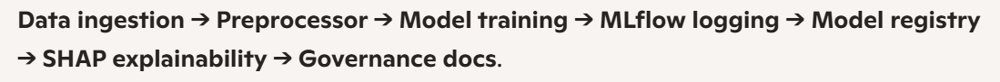

# Credit Risk Probability Model using Alternative Data

## Overview
This project builds a **machine learning pipeline** to predict credit risk using **alternative transaction data**.  
It demonstrates end‑to‑end ML engineering: preprocessing, training, explainability (SHAP), governance, monitoring, and deployment.  
The goal is to showcase a **portfolio‑grade capstone** that blends technical depth with business framing — ready for recruiters and stakeholders.

---

## Architecture


**Pipeline Flow:**
1. **Data ingestion** → `transactions_with_target.csv`
2. **Preprocessing** → categorical + numerical transformations
3. **Model training** → Logistic Regression
4. **Experiment tracking** → MLflow (metrics, parameters, artifacts)
5. **Model registry** → versioning with aliases (Production, Staging)
6. **Explainability** → SHAP global + local plots
7. **Governance** → proxy limitations + monitoring plan

---

## Setup Instructions
Clone the repo and install dependencies:

```bash
git clone https://github.com/redecon/Credit-Risk-Probability-Model-for-Alternative-Data.git
cd Credit-Risk-Probability-Model-for-Alternative-Data
pip install -r requirements.txt
```

---

**Run with Docker:**

```bash
docker compose up
```

**Train the model:**

```bash
python -m src.train
```

## Usage
**Train & Log Model**
```bash
python -m src.train
```
**Outputs:**

- Metrics (Precision, Recall, F1)

- Parameters

- Artifacts (preprocessor, evaluation table, governance doc)

- SHAP explainability plots

---

## API Example
```bash
curl -X POST http://localhost:8000/predict \
  -H "Content-Type: application/json" \
  -d '{"Amount": 5000, "ChannelId": 2, "ProductCategory": "airtime"}'
```
**Response:**

```json
{
  "risk_score": 0.82,
  "is_high_risk": true,
  "explanation": {
    "Amount": "↑ increased risk",
    "ChannelId": "↑ increased risk",
    "ProductCategory": "↑ increased risk"
  }
}
```
## Outputs
**MLflow UI →** metrics, parameters, artifacts

**SHAP Global Importance →** top drivers: Amount, ChannelId, ProductCategory

**Single Prediction Explanation →** transparency for individual customers

**Governance Docs →** rationale + proxy limitations

**Monitoring Plan →** drift detection, fairness audits, alerting
Screenshots available in docs/screenshots/

---

## Governance & Monitoring
- **Model Registry →** MLflow with aliases (Production, Staging, Archived)

- **Feature Importance Rationale →** documented in docs/models.md

- **Monitoring Plan →** documented in docs/monitoring.md

       - Track prediction drift

       - Audit fairness via SHAP subgroup analysis

       - Alert if feature importance shifts significantly

  ---

#### This project demonstrates:

- **ML Engineering →** reproducible pipelines, Docker, CI/CD

- **Explainability →** SHAP integration, stakeholder‑ready narratives

- **Governance →** proxy limitations, monitoring, registry practices

- **Communication →** professional documentation, Medium‑style report

It is a capstone project to showcase readiness for roles in Data Science, ML Engineering, and Technical Change Management.